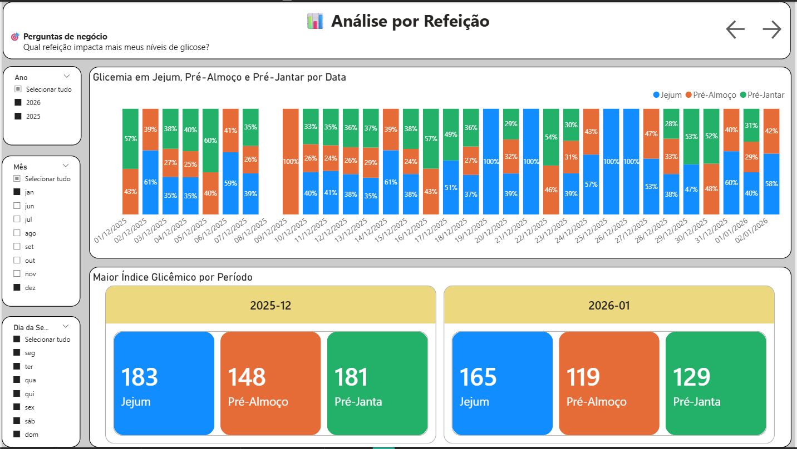

<p align="center">
  
</p>

<h1 align="center">📊 Monitoramento e Análise de Glicemia com Power BI</h1>

<p align="center">
Projeto de análise de dados voltado ao monitoramento glicêmico, utilizando Power BI, DAX e boas práticas de visualização para apoiar decisões em saúde.
</p>

## 📌 Visão Geral
Este projeto tem como objetivo analisar dados de glicemia coletados diariamente, explorando padrões temporais, comportamento por refeição, impacto da rotina e variações entre dias úteis e fins de semana.

O dashboard foi desenvolvido no **Power BI**, utilizando boas práticas de **modelagem de dados**, **DAX**, **tabela calendário** e **storytelling com dados**, com foco em gerar insights claros e acionáveis.

---

## 🎯 Objetivo do Projeto
- Monitorar a evolução da glicemia ao longo do tempo  
- Identificar padrões por refeição (jejum, almoço e jantar)  
- Avaliar o impacto da rotina alimentar e horários  
- Comparar comportamento glicêmico entre dias úteis e fins de semana  
- Transformar dados de saúde em informação visual para apoio à tomada de decisão  

---

## 🧩 Power BI Project (.PBIR)

Este projeto utiliza o formato **Power BI Project (.pbir)**, que permite versionamento eficiente e colaboração via Git.

### Vantagens:
- Versionamento de medidas DAX
- Histórico claro de alterações
- Melhor colaboração entre analistas
- Alinhado a boas práticas modernas de BI

### Requisitos:
- Power BI Desktop atualizado para abrir o projeto

---

## 🗂️ Fonte dos Dados
- Dados reais de medições de glicemia
- Coleta diária
- Estrutura em Excel
- Período contínuo de acompanhamento

> ⚠️ Os dados não contêm informações sensíveis ou identificáveis.

---

## 🧱 Modelagem de Dados

### 📅 Tabela Calendário
Foi criada uma tabela calendário dedicada para:
- Análises temporais
- Segmentação por dia da semana
- Identificação de fins de semana
- Análises mensais e acumuladas

Relacionamento:
- dCalendario[Date] 1 ──── * fGlicemia[Data]

---

## 📐 Principais Medidas DAX

- Média de glicemia em jejum
- Média por refeição
- Média geral diária
- Média móvel (7 dias)
- Classificação por faixa glicêmica
- Comparação entre dias úteis e fins de semana
- Análise de horários (dispersão)

Exemplo:
```DAX
Media Geral Glicemia =
AVERAGEX (
    fGlicemia,
    DIVIDE (
        fGlicemia[GlicemiaJejum]
        + fGlicemia[GlicemiaAlmoco]
        + fGlicemia[GlicemiaJantar],
        3
    )
)

````

## 📊 Estrutura do Dashboard

🔹 Página 1 — Visão Geral

  - KPIs principais
  - Evolução da glicemia em jejum
  - Média móvel
  - Segmentadores de data

🔹 Página 2 — Análise por Refeição

  - Comparação entre jejum, almoço e jantar
  - Distribuição dos valores
  - Identificação de picos

🔹 Página 3 — Rotina e Comportamento

  - Dias úteis × fins de semana
  - Análise por dia da semana
  - Dispersão: horário × glicemia

🔹 Página 4 — Detalhamento Diário

  - Tabela detalhada
  - Formatação condicional
  - Observações por data

## 💡 Principais Insights

  - Fins de semana apresentam média glicêmica superior aos dias úteis
  - Horários mais tardios de refeição tendem a se associar a níveis mais elevados de glicemia
  - O controle glicêmico é mais estável em dias de rotina regular
  - A glicemia antes do jantar apresenta maior variabilidade

## 🧠 Tecnologias Utilizadas

  - Power BI

  - DAX

  - Excel

  - Modelagem Dimensional

  - Storytelling com Dados

## 🚀 Próximos Passos

  - Inclusão de metas parametrizadas
  
  - Expansão da série histórica
  
  - Comparação mensal e trimestral
  
  - Análises preditivas futuras

---

## 🖼️ Prints do Dashboard

### 🔹 Visão Geral


**Descrição:**  
Evolução da glicemia em jejum ao longo do tempo, indicadores principais e média móvel para identificação de tendências.

---

### 🔹 Análise por Refeição


**Descrição:**  
Comparação entre glicemia em jejum, antes do almoço e antes do jantar, destacando variações e padrões ao longo do dia.

---

### 🔹 Rotina e Comportamento


**Descrição:**  
Comparação entre dias úteis e fins de semana e análise da relação entre horário das refeições e níveis glicêmicos.

---

### 🔹 Detalhamento Diário


**Descrição:**  
Visão detalhada por data com formatação condicional e observações, permitindo identificar dias críticos.

### 🎨 Legenda da Formatação Condicional

A tabela **Detalhamento Diário** utiliza cores para facilitar a leitura dos níveis de glicemia:

- 🟢 **Aceitável:** < 125 mg/dL  
- 🟡 **Atenção:** < 180 mg/dL  
- 🔴 **Alerta:** acima de 180 mg/dL  

Essa padronização permite rápida identificação de padrões e situações críticas.


## 🔗 Links clicáveis

## 📊 Relatório Power BI (PBIR)

Este projeto utiliza o formato **PBIR (Power BI Project)**, que permite versionamento e controle fino dos artefatos do relatório.

📁 Pasta do relatório:
- `Monitoramento e Análise de Glicemia com Power BI.Report`

📁 Modelo semântico:
- `Monitoramento e Análise de Glicemia com Power BI.SemanticModel`

ℹ️ Para abrir o projeto:
1. Clone o repositório
2. Abra a pasta raiz no **Power BI Desktop**
3. O relatório será carregado automaticamente

📂 **Power BI Project (.PBIR):**  
🔗 [Estrutura do Relatório Power BI (PBIR)](powerbi/Monitoramento%20e%20Análise%20de%20Glicemia%20com%20Power%20BI.Report)

📘 **Storytelling do Projeto:**  
[Leia o storytelling completo](docs/storytelling.md)

🖼️ **Imagens do Dashboard:**  
[Ver todos os prints](images/)

🔗 **Post no LinkedIn:**  
[Veja o post completo no LinkedIn](https://www.linkedin.com/in/mauriciodasilvabarros/)

## 👤 Autor    
  Maurício Barros    
  Analista de Dados    
  🔗 GitHub: https://github.com/opusvix

  


